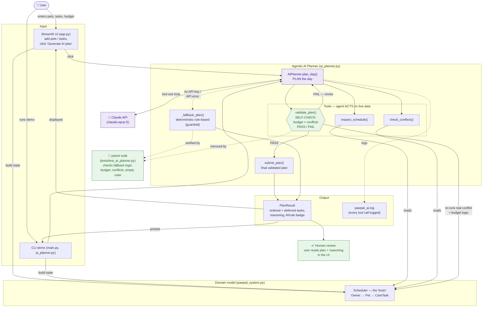

# PawPal+ System Diagram

How the pieces fit together and how a request flows from input to a validated
plan. The AI feature is an **agentic workflow**: the agent plans, acts on the
live `Scheduler` through tools, and checks its own work with a validator before
submitting. Human review and the automated test suite are the two places where
AI results are checked.

## Where AI results get checked

| Checkpoint | What it checks | Where in code |
|---|---|---|
| **`validate_plan` (self-check)** | The agent checks its **own** proposed plan against the real conflict + time-budget logic and must get `PASS` before submitting. | `ai_planner.py` → `validate_plan` |
| **Human review** | The user reads the final ordered plan and the AI's written reasoning in the UI and decides whether to act on it. | `app.py` → AI Care Planner section |
| **Automated tests** | `pytest` verifies the deterministic fallback (budget limits, conflict resolution, empty schedule) — the same rules the AI's validator enforces. | `tests/test_ai_planner.py` |

## Data flow in one line

**Input** (pets/tasks/budget) → **Scheduler** state → **Agent** plans and calls
tools → **self-check** (`validate_plan`) loops until PASS → **submit** (or
**fallback** if no key) → **PlanResult** → shown to the **user** for review.
